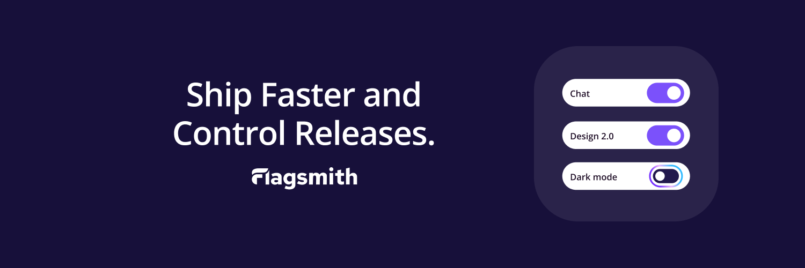

[](https://www.flagsmith.com/)

[](https://github.com/Flagsmith/flagsmith/stargazers)
[](https://hub.docker.com/u/flagsmith)
[](https://hub.docker.com/r/flagsmith/flagsmith)
[](https://discord.gg/hFhxNtXzgm)
[](https://codecov.io/gh/Flagsmith/flagsmith)
[](https://opensource.org/licenses/BSD-3-Clause)
<a href="https://depot.dev?utm_source=Flagsmith"></a>

<p align="center">
  <a href="https://www.flagsmith.com/demo">
  
</p>
<p align="center">
  <a href="https://www.flagsmith.com/demo">Try our interactive demo </a>
</p>


# [Flagsmith](https://flagsmith.com/) is an Open-Source Feature Flagging Tool to Ship Faster & Control Releases 

Change the way your team releases software. Roll out, segment, and optimise—with granular control. Stay secure with on-premise and private cloud hosting.

* Feature flags: Release features behind the safety of a feature flag
* Make changes remotely: Easily toggle individual features on and off, and make changes without deploying new code
* A/B testing: Use segments to run A/B and multivariate tests on new features
* Segments: Release features to beta testers, collect feedback, and iterate 
* Organisation management: Stay organised with orgs, projects, and roles for team members
* SDKs & frameworks: Choose from 15+ popular languages like Typescript, .NET, Java, and more. Integrate with any framework, including React, Next.js, and more
* Integrations: Use your favourite tools with Flagsmith

Flagsmith makes it easy to create and manage feature flags across web, mobile, and server side applications. Just wrap
a section of code with a flag, and then use Flagsmith to toggle that feature on or off for different environments, users
or user segments.

## Get up and running in less than a minute:

```bash
curl -o docker-compose.yml https://raw.githubusercontent.com/Flagsmith/flagsmith/main/docker-compose.yml
docker-compose -f docker-compose.yml up
```

The application will bootstrap an admin user, organisation, and project for you. You'll find a link to set your password
in your Compose logs:

```txt
Superuser "admin@example.com" created successfully.
Please go to the following page and choose a password: http://localhost:8000/password-reset/confirm/.../...
```


## Flagsmith Open Source

The Flagsmith repository is comprised of two core components - the [REST API](https://github.com/Flagsmith/flagsmith/tree/main/api) and the [frontend dashboard](https://github.com/Flagsmith/flagsmith/tree/main/frontend).

Further documentation for these can be found at: 

* [API](https://docs.flagsmith.com/deployment/hosting/locally-api)
* [Frontend](https://docs.flagsmith.com/deployment/hosting/locally-frontend)

## Flagsmith hosted SaaS
You can try our hosted version for free at https://flagsmith.com

## Community Resources + Contribution Guidelines

* [Visit our docs](https://docs.flagsmith.com/)
* [Chat with other developers on Discord](https://discord.com/invite/hFhxNtXzgm)
* If you need help getting up and running, please [get in touch](https://www.flagsmith.com/contact-us)

We love contributions from the community and are always looking to improve! Here are our [contribution guidelines](https://docs.flagsmith.com/platform/contributing). 

## Open Source Philosophy

The majority of our platform is open source under the [BSD-3-Clause license](https://github.com/Flagsmith/flagsmith?tab=BSD-3-Clause-1-ov-file#readme). A small number of repositories are under the MIT license.

We built Flagsmith as the open source feature flag tool we needed but couldn't find on GitHub. Our core functionality stays open, always. Read our [open letter to developers](https://www.flagsmith.com/about-us).

## Open Source vs Paid

With our core functionality being open, you can use our open-source feature flag and remote config management platform no matter what. Enterprise-level governance and management features are available with a valid Flagsmith Enterprise license.

To learn more, [contact us](https://www.flagsmith.com/contact-us) or see our [version comparison](https://docs.flagsmith.com/version-comparison).

## Contributors

Thank you to the open source community for your contributions and for building this with us!  

<a href="https://github.com/flagsmith/flagsmith/graphs/contributors">
  
</a>

Made with [contrib.rocks](https://contrib.rocks).
