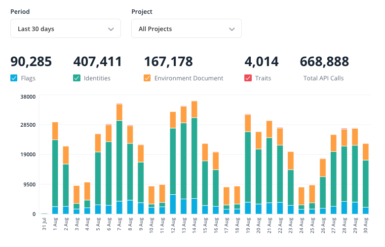

When you use Flagsmith on Flagsmith-managed infrastructure (SaaS or private cloud), your pricing plan has a limit of API
requests per month. This document describes how these limits work, how to estimate how many API requests your
applications will need, and how to reduce the volume of API requests made by your applications.

:::tip

Self-hosted Flagsmith installations do not have API request limits.

:::

## How can I check my current usage?

To check your API usage for the past 90 days:

1. Log in to the Flagsmith dashboard as an organisation administrator.
2. Click on your organisation name in the top left.
3. Browse to the **Usage** tab.

From this page, you can break down usage per project and per environment.

The following screenshot shows an example usage graph from the Flagsmith dashboard:

## What are billable API requests?

When your application is integrated with Flagsmith, it makes requests to the Flagsmith API to perform actions such as
retrieving the current state of its flags. Some of these actions count towards your limit of billable API requests. The
billable API requests that your application makes depend mainly on which [flag evaluation mode](/integrating-with-flagsmith/integration-overview) it uses.

**Remote Evaluation** is the default for all applications. Applications using Remote Evaluation call the Flagsmith API
  when they need to fetch the flags for the current environment or user.
  - `/flags`: [Get environment flags](https://api.flagsmith.com/api/v1/docs/#/api/api_v1_flags_list)
  - `/identities`: [Get identity flags](https://api.flagsmith.com/api/v1/docs/#/api/api_v1_environments_identities_create)

**Local Evaluation** is optional, and only for server-side applications. Each individual application or
[Edge Proxy](/performance/edge-proxy) instance polls the Flagsmith API at a configurable interval (60 seconds by
default) to fetch the flags for the current environment and all users in one API request.
  - `/environment-document`: [Get environment document](https://api.flagsmith.com/api/v1/docs/#/api/api_v1_environment-document_list)

The following requests are not billable:

- [Admin API](/integrating-with-flagsmith/flagsmith-api-overview/admin-api) requests.
- Requests made by Flagsmith SDKs to track [Flag Analytics](/managing-flags/flag-analytics).
- Connecting to a [real-time flag updates](/performance/real-time-flags) stream.

### Example: client-side application

Consider a website or mobile application that can be used by anonymous or authenticated users. A typical session would
look like this:

1. A user visits the application for the first time. The user's device calls Flagsmith to get the flags for the
   production environment (1 API request).
2. The user logs in to their account. Now that we know the user's identity, their device calls Flagsmith to get the
   flags for this specific user, taking into account their
   [A/B tests or progressive rollouts](/managing-flags/experimentation-ab-testing), [segments](/flagsmith-concepts/segments) and user-specific
   flags (1 API request). Any user data sent by your application is stored by Flagsmith as traits.
3. The user performs some action that should update their stored data in Flagsmith. The device calls Flagsmith to update
   this user's traits and receives their latest flags in return (1 API request).

Client-side SDKs optionally support caching and polling depending on how fresh your application needs its flags to be.

Following the example above, suppose your application caches flags for 10 minutes, with each session lasting 20 minutes
on average. You could estimate your monthly API usage as:

> **Monthly sessions** × (**2 flag updates per session** + **3 flag requests per session**)

### Example: server-side application

Consider a service that can serve requests for anonymous or unauthenticated users. If the service uses Local Evaluation,
its lifecycle could look like this:

1. A service instance starts up and starts polling Flagsmith to retrieve its environment definition (1 API request per
   minute per instance)
2. A request for an anonymous user arrives. The service uses its environment definition stored in memory and responds
   (no API requests consumed).
3. A request for an authenticated user arrives:
    1. The service retrieves any user information required to evaluate their flags from their session/token, or from an
       external service.
    2. The service's Flagsmith SDK uses the current environment definition stored in memory to calculate the flags for
       this user based on the traits retrieved in the previous step (no API requests consumed).

"Service" in this context refers to any of the following:

- An instance of your application, running in a container or server, using the Flagsmith SDK with Local Evaluation
  enabled.
- An [Edge Proxy](/performance/edge-proxy) container instance.

Following the example above, if you used the default polling frequency of 60 seconds, you could estimate your monthly
API usage as:

> **Number of service instances** × **43,200 polls per month**

## What happens if I exceed my API call limit?

If you exceed your API call limit, your account may be blocked or charged for overages depending on your pricing plan.
For more details, see [Traffic Limits](/administration-and-security/governance-and-compliance/system-limits#traffic-limits).

Accounts on paid plans are never blocked automatically.

## How can I optimise my API usage?

The only way to optimise your API usage is to make fewer API calls. Depending on your specific application and which
evaluation mode it uses, there are several strategies to more efficiently use the Flagsmith API.

For client-side applications (web, desktop and mobile):

* Consider using caching to avoid requesting flags every time your application starts up. If you are already using
caching, increase the cache expiration time or TTL.
* Instead of updating flags at a regular interval by polling, update the flags when certain events happen in your
application. For example, when a user visits a certain part of your application that requires up-to-date flags, or when
a mobile application is brought to the foreground.
* Consider using an Edge Proxy as your source of flags instead of calling the Flagsmith API directly.
* If you have a suitable backend, consider evaluating flags server-side instead. This enables other usage patterns that
result in fewer API calls, such as [Local Evaluation](/integrating-with-flagsmith/integration-overview#local-evaluation-mode) and custom cache implementations.

For server-side applications:

* Consider using [Local Evaluation](/integrating-with-flagsmith/integration-overview#local-evaluation-mode), or deploying [Edge Proxies](/performance/edge-proxy).
* Reduce the polling rate for Edge Proxies and any SDKs using Local Evaluation.
* If your use case allows for it, use the Flagsmith SDK in Offline Mode.

Using [real-time flag updates](/performance/real-time-flags) can also reduce or eliminate the need for polling.
