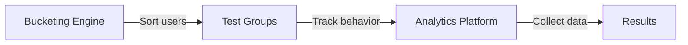
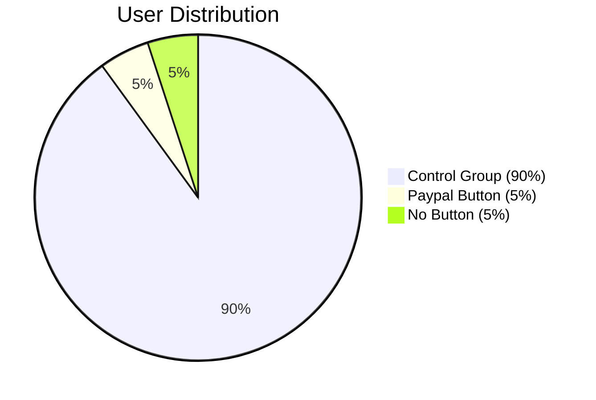

A/B testing enables you to experiment with design and functionality variants of your application. The data generated
will allow you to make modifications to your app, safe in the knowledge that it will have a net positive effect.



You can use Flagsmith to perform A/B Tests using:
- [Multivariate Flags](/basic-features/managing-features.md#multi-variate-flags) for user segmentation
- Analytics tools like [Amplitude](https://amplitude.com/) or [Mixpanel](https://mixpanel.com/) for data collection

## Key Components

### 1. Bucketing Engine
Controls which users see which variants by:
- Segmenting users into test groups
- Maintaining consistent experiences
- Managing percentage splits

### 2. Analytics Platform
Tracks the impact of changes through:
- Event data collection
- User behavior analysis
- Conversion tracking


## Example: Testing a Paypal Button

### Current Situation
- App only accepts Credit Card payments
- Hypothesis: Adding Paypal could increase conversions
- Need to test with small user group first

### Test Structure


## Creating the Test

### Step 1: Configure the Flag

1. Navigate to Features in your dashboard
2. Click "Add Feature"
3. Name it `paypal_button_test`
4. Enable "Multivariate Options"


:::tip
Make sure to use a descriptive name that clearly indicates the test purpose
:::
### Step 2: Set Up Variants

Configure the following options:

| Variant Name | Description | Percentage |
|--------------|-------------|------------|
| control | Control group - no changes | 90% |
| show | Show Paypal button | 5% |
| hide | Hide Paypal button | 5% |

Here is what creating the Flag would look like:


### Step 3: Implement in Code

```javascript
// 1. Identify the user
flagsmith.identify('user-123');

// 2. Get the flag value
const paypalTest = await flagsmith.getValue('paypal_button_test');

// 3. Apply the variant
if (paypalTest === 'show') {
    showPaypalButton();
}

// 4. Track the event
analytics.track('paypal_button_test', {
    variant: paypalTest,
    page: 'checkout'
});
```

:::note
Always identify users before checking flag values to ensure consistent experiences
:::
### Step 4: Monitor Results

1. Deploy your changes
2. Enable the flag in your environment
3. Monitor analytics for:
   - Conversion rates per variant
   - Average order value
   - Payment completion rates


## Testing Anonymous Users

For users who aren't logged in:

1. Generate a GUID on first visit
```javascript
const anonymousId = crypto.randomUUID();
```

2. Store in browser storage
```javascript
localStorage.setItem('visitor_id', anonymousId);
```

3. Identify with Flagsmith
```javascript
flagsmith.identify(anonymousId);
```


## Best Practices

1. **Start Small**: Begin with a small percentage and gradually increase
2. **Track Everything**: Log all relevant events and interactions
3. **Be Patient**: Run tests long enough to gather significant data
4. **Document Changes**: Keep track of all test parameters and changes

:::warning **Remember**
Always implement a fallback behavior in case flag evaluation fails
:::
:::tip
Need help? Check our [support page](/support)
:::