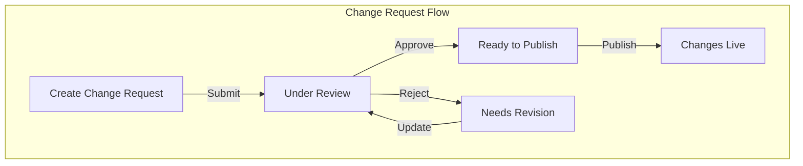

# Change Requests

:::tip
Change requests are part of our [Scale-Up and Enterprise plans](/version-comparison).
:::

## Overview

Change Requests add workflow control to flag value modifications, similar to Git Pull Requests. They ensure changes (especially in Production) get proper review before deployment.



## Required Permissions

For a complete list of available permissions, see the [permissions reference](/system-administration/rbac#permissions-reference).

| Action | Required Permission | Details |
|--------|-------------------|----------|
| Create Changes | Update Feature | Project level permission |
| Review Changes | Environment Write | Environment level access |
| Publish Changes | Environment Admin | Environment level access |

## Workflow Steps

### 1. Setup Change Requests

Change Requests are configured at the Environment level. To enable Change Requests, go to the Environment Settings Page, Enable the Change Request setting, and select how many approvals you would like for each Change Request to be applied.

### 2. Creating Changes

When modifying flags in protected environments:

1. Select flag to modify
2. Click "Create Change Request" button (top-right of flag details)
3. Provide required information:
   ```text
   Title: [Required] Brief description
   Description: [Optional] Detailed explanation
   Reviewers: [Required] At least one assignee
   ```

:::tip
Users need Update Feature permissions to create requests
:::
### 3. Review Process

Reviewers will:
1. Receive email notification when assigned
2. Access Change Requests area from main navigation
3. Review proposed changes:
   - Current flag state
   - Proposed modifications
   - Change description
4. Take action:
   - Approve
   - Request changes
   - Add comments

:::tip
Reviewers need Environment Write permissions
:::
### 4. Publishing Changes

Once approved:
1. Original requester gets notification
2. "Publish Change" button becomes available
3. Changes apply immediately on publish


:::tip Best Practices
- Use clear titles describing the change
- Add detailed descriptions for complex changes
- Assign multiple reviewers for critical environments
- Use [audit logging](/system-administration/audit-logs) for tracking
:::

:::warning
 Review your environment configuration before enabling Change Requests in Production
:::
