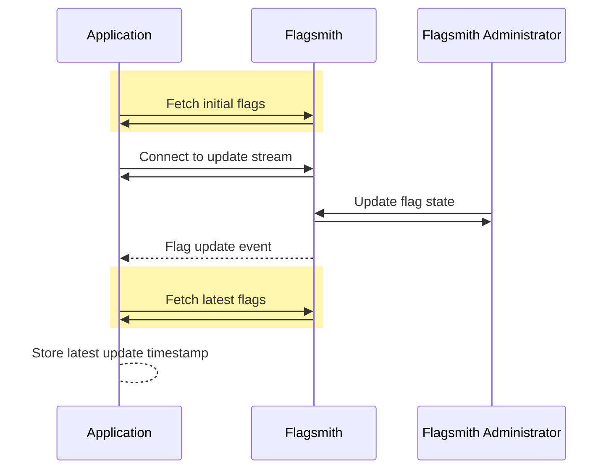

When an application fetches its current feature flags, it usually caches the flags for a certain amount of time to make
[efficient use](/guides-and-examples/efficient-api-usage) of the Flagsmith API and network resources. In some cases, you
may want an application to be notified about feature flag updates without needing to repeatedly call the Flagsmith API.
You can achieve this by subscribing to real-time flag updates.

## Prerequisites

Real-time flag updates require an Enterprise subscription.

If you are self-hosting Flagsmith, real-time flag updates require
[additional infrastructure](/deployment/hosting/real-time).

## Setup

To enable real-time flag updates for your Flagsmith project:

1. Log in to the Flagsmith dashboard as a user with project administrator permissions.
2. Navigate to **Project Settings > SDK Settings**.
3. Enable **Real-time updates**.

Applications using a supported Flagsmith SDK do not subscribe to real-time flag updates by default. Refer to your SDK's
documentation for subscribing to real-time flag updates.

## How it works

The following sequence diagram shows how a typical application would use real-time flag updates.
[Billable API requests](/billing) are highlighted in yellow.



Your application subscribes to real-time flag updates by opening a long-lived
[server-sent events (SSE)](https://developer.mozilla.org/en-US/docs/Web/API/Server-sent_events) connection to Flagsmith,
which is specific to its current environment.

When the environment is updated in some way, either via the Flagsmith dashboard or the
[Admin API](/clients/rest#private-admin-api-endpoints), all clients connected to that environment's real-time stream
will receive a message containing the latest update's timestamp. If your application's latest flags are older than the
received timestamp, it requests the latest flags from Flagsmith. When your application receives the latest flags, you
must propagate the latest flag state throughout your application as necessary.

## Limitations

Real-time flag update events only contain a timestamp indicating when any flag in the environment was last updated.
Applications must still call the Flagsmith API to get the actual flags for their current environment or user.

Only changes made to environments or projects result in flag update events. For example, the following operations will
cause updates to be sent:

- Manually toggling a flag on or off, or changing its value.
- A [scheduled Change Request](/advanced-use/scheduled-flags) for a feature goes live.
- Creating or updating segment overrides for a feature.
- Changing a segment definition.

Identity-level operations _will not_ cause updates to be sent:

- Updating an identity's traits.
- Creating or updating an identity override.

The following SDK clients support subscribing to real-time flag updates:

- JavaScript
- Android
- iOS
- Flutter
- Python
- Ruby

## Implementation details

The event source URL used by Flagsmith SDKs is:

```
https://realtime.flagsmith.com/sse/environments/ENVIRONMENT_ID/stream
```

Each real-time flag event message is a JSON object containing a Unix epoch timestamp of the environment's last update:

```json
{
  "updated_at": 3133690620000
}
```

You can test real-time flag updates by using cURL to connect to the event source URL:

```
curl -H 'Accept: text/event-stream' -N -i https://realtime.flagsmith.com/sse/environments/ENVIRONMENT_ID/stream
```
