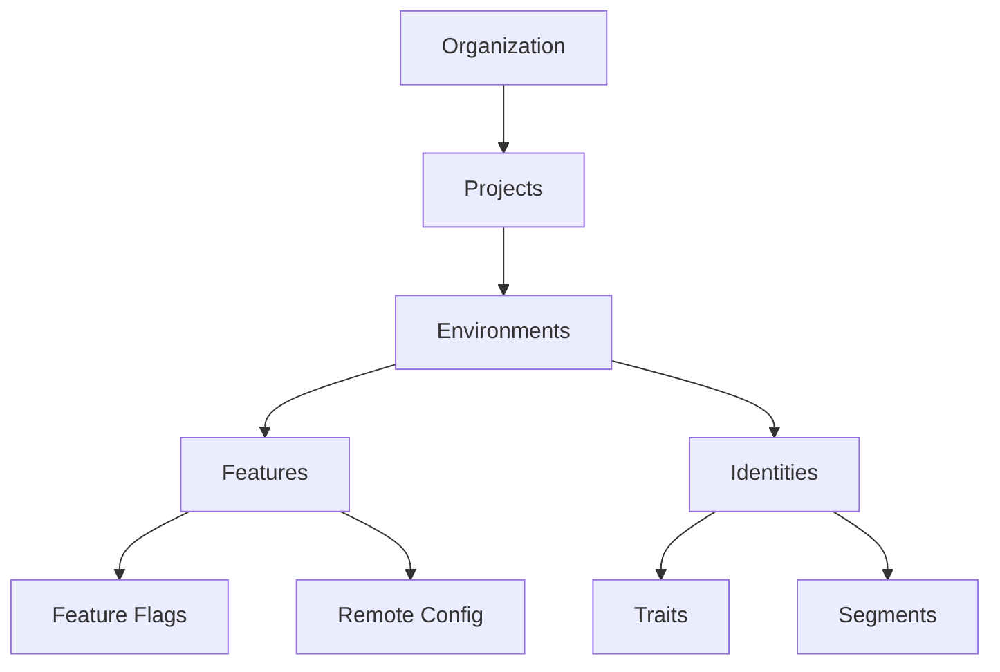
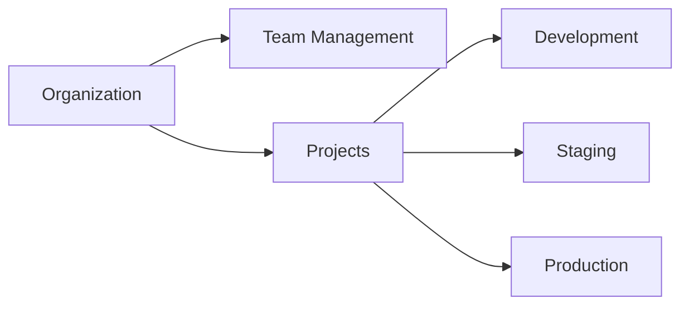
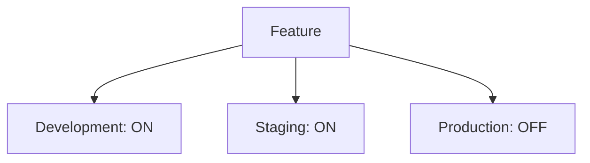

import Card from '@site/src/components/Card';
import CardHeader from '@site/src/components/Card/CardHeader';
import CardBody from '@site/src/components/Card/CardBody';

# Feature Flags - An Overview

Feature flags enable fine-grained control over your application's functionality. They allow you to:

  

    <Card>
      <CardHeader>
        <h3>🚀 Deploy Safely</h3>
      </CardHeader>
      <CardBody>
        Ship code to production behind feature flags and control its rollout from the dashboard.
      </CardBody>
    </Card>
  

  
  

    <Card>
      <CardHeader>
        <h3>🔬 Test in Production</h3>
      </CardHeader>
      <CardBody>
        Enable features for specific users, segments, or environments to gather real-world feedback.
      </CardBody>
    </Card>
  

  
  

    <Card>
      <CardHeader>
        <h3>⚡ Move Fast</h3>
      </CardHeader>
      <CardBody>
        Decouple deployment from release to ship code more frequently with less risk.
      </CardBody>
    </Card>
  

## Core Concepts

### Organizations and Projects
Organizations are containers for your projects and team members. Projects help you organize related features and environments.

### Environments and Features
Features are shared across environments but can have different states in each one:

### Identities, Traits and Segments

  

    <Card>
      <CardHeader>
        <h3>👤 Identities</h3>
      </CardHeader>
      <CardBody>
        Individual users in your application. Each environment has its own set of identities.
      </CardBody>
    </Card>
  

  
  

    <Card>
      <CardHeader>
        <h3>📊 Traits</h3>
      </CardHeader>
      <CardBody>
        Key-value pairs storing user data like preferences, usage stats, or custom attributes.
      </CardBody>
    </Card>
  

  
  

    <Card>
      <CardHeader>
        <h3>🎯 Segments</h3>
      </CardHeader>
      <CardBody>
        Groups of users defined by their traits, enabling targeted feature rollouts.
      </CardBody>
    </Card>
  

:::tip Learn More
- [Managing Identities](/basic-features/managing-identities)
- [Working with Traits](/basic-features/managing-identities#identity-traits)
- [Creating Segments](/basic-features/segments)
:::
