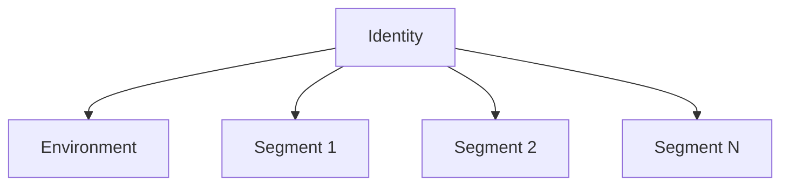
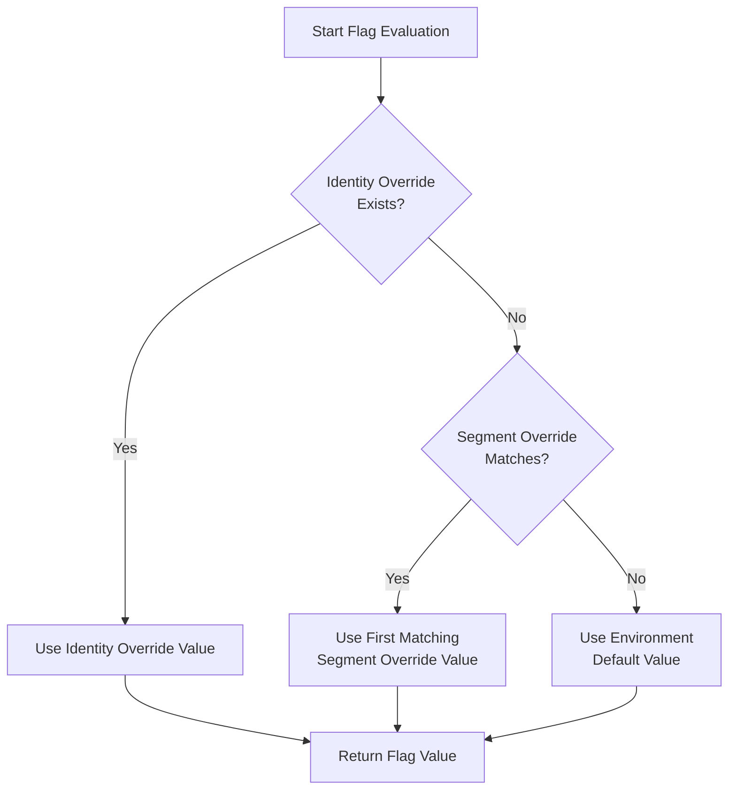

import Tabs from '@theme/Tabs';
import TabItem from '@theme/TabItem';

# Segments

A segment is a subset of [identities](/basic-features/managing-identities.md), defined by a set of rules that match
identity [traits](managing-identities.md#identity-traits). An identity always belongs to a single environment and can
belong to any number of segments.



## Overview

Once you have defined a segment, you can create **segment overrides** for features within an environment. A segment
override allows you to control the state of a feature only for identities that belong to a specific segment. This is
similar to how [identity overrides](managing-identities.md#identity-overrides) let you control the state of features for
an explicit set of identities that is known in advance.

Because segments are driven by identity traits, your application must identify the user when retrieving flags in order
for segment overrides to be applied. If your user is not identified, no overrides will be applied and all flags will be
returned exactly how they are defined in the current environment.

## Common Use Cases

Segments and segment overrides can be used to implement many scenarios:

### Testing in Production
```javascript
// Set up internal user traits
flagsmith.identify('user_123');
flagsmith.setTrait('email', 'employee@company.com');
flagsmith.setTrait('department', 'engineering');

// Segment Rule: email Contains @company.com AND department = engineering
```

### Power Users
```javascript
// Track user engagement
flagsmith.setTrait('login_count', 50);
flagsmith.setTrait('has_completed_profile', true);
flagsmith.setTrait('days_since_signup', 30);

// Segment Rules:
// Rule 1: login_count >= 20
// Rule 2: has_completed_profile = true
// Rule 3: days_since_signup >= 14
```

### Staged Rollouts
```javascript
// Create segment with percentage split
// Week 1: % Split = 10
// Week 2: % Split = 25
// Week 3: % Split = 50
// Week 4: Remove segment override
```

## Security and privacy

The Flagsmith API to set user traits, e.g. the `setTraits` method from the JavaScript SDK, does not require
authentication or credentials. This means that users can change their own traits, which could be a security problem if
you are using segments for authorisation or access control.

### Security Recommendations
- Disable ["Persist traits when using client-side SDK keys"](system-administration/security.md#preventing-client-sdks-from-setting-traits) for sensitive environments
- Use server-side SDKs to set traits for access control
- Client-side SDKs can still read traits and flags

Segment definitions are:
- Not included in remote evaluation mode responses
- Only served to clients in local evaluation mode
- Never exposed through SDK flag retrieval methods

## Creating Segments

### Project-wide Segments
1. Navigate to Segments page in dashboard
2. Create segment with rules
3. Apply segment override to any feature

### Feature-specific Segments
1. Go to specific feature
2. Open Segment Overrides tab
3. Click "Create Feature-Specific Segment"
4. Define segment rules

> Note: Project segments cannot be converted to feature-specific segments or vice versa.

## Rule Evaluation

### Order of Rules
Rules are evaluated top-to-bottom. Example impact:

```javascript
// Scenario 1:
// 1. 10% percentage split
// 2. is_subscriber = true
// Result: 10% of ALL users, then filter for subscribers

// Scenario 2:
// 1. is_subscriber = true
// 2. 10% percentage split
// Result: ALL subscribers, then take 10%
```

## Flag evaluation precedence



## Trait Data Types

Supported trait types:
- String
- Boolean
- Integer
- Float

### Type Coercion
- Segment rule values stored as strings
- Coerced to match trait type during evaluation
- Provides backwards compatibility

Examples:
```javascript
// Boolean trait
flagsmith.setTrait('accepted_cookies', true);

// String trait - both work
flagsmith.setTrait('accepted_cookies', 'true');
flagsmith.setTrait('accepted_cookies', 'partial');

```
These string values evaluate to true:
 - "True"
 - "true"
 - "1"
## Rule Operators Reference

### Comparison Operators
| Operator | Description | Example |
|----------|-------------|----------|
| `Exactly Matches (=)` | Trait value equals rule value | `age = 21` |
| `Does not match (!=)` | Trait value not equal to rule value | `country != US` |
| `>` | Trait value greater than rule value | `logins > 10` |
| `>=` | Trait value greater than/equal to rule value | `spent >= 100` |
| `<` | Trait value less than rule value | `age < 18` |
| `<=` | Trait value less than/equal to rule value | `version <= 2.1` |

### String Operators  
| Operator | Description | Example |
|----------|-------------|----------|
| `Contains` | Rule value is substring of trait value | `email Contains @company.com` |
| `Does not contain` | Rule value not substring of trait value | `plan Does not contain free` |
| `Matches regex` | Trait matches regular expression | `email Matches .*@gmail\.com` |
| `In` | Trait equals any value in comma-separated list | `country In US,UK,CA` |

### Special Operators
| Operator | Description | Example |
|----------|-------------|----------|
| `% Split` | Identity in percentage bucket | `% Split = 25` |
| `Is set` | Trait exists for identity | `premium_until Is set` |
| `Is not set` | Trait doesn't exist for identity | `trial_ended Is not set` |
| `SemVer` | Semantic version comparison | `version SemVer >= 2.1.0` |
| `Modulo` | Remainder after division | `user_id % 2|0` |

### Operator Details

<Tabs groupId="operators" queryString>
<TabItem value="in" label="In">
The `In` operator lets you match a trait value against a comma-separated list of values. For example, the segment rule
value might read `21,682,8345`. This would match against a trait value of `682` but not against a trait value of `683`
or `834`.

The `In` operator can be useful to build segments that represent a specific set of tenants in your application. For
example, you could create a segment with the following rule: `tenant_id In tenant_1,tenant_2,tenant_3`
</TabItem>
<TabItem value="semver" label="SemVer">
[SemVer](https://semver.org/) operators compare semantic version values. Consider the following segment rule:

`version` `SemVer >=` `4.2.52`

This segment would include all users that have a `version` trait set to `4.2.52` or greater. For example, any of the
following `version` values would match:

- `4.2.53`
- `4.10.0`
- `5.0.0`

Versions are compared as defined by the [Semantic Versioning specification](https://semver.org/#spec-item-11).
</TabItem>
<TabItem value="percent" label="Percentage Split">
Percentage Split is the only operator that does not require a trait. You can use it to drive
[A/B tests](/advanced-use/ab-testing) and
[staged feature rollouts](/guides-and-examples/staged-feature-rollouts#creating-staged-rollouts).

Percentage Split deterministically assigns a "bucket" to each identity solely based on its ID and not any traits,
meaning that Segment overrides that use Percentage Split will always result in the same feature value for a given
identity.

If you create a Segment with a single Percentage Split rule, Identities who are members of that split when the split
value is set to, say, 10% will be guaranteed to also be in that split if it is changed to a value higher than 10%.

If the Percentage Split is reduced in value, some Identities will be removed from that Percentage Split to maintain the
balance. The algorithm is fairly simple and good to understand - it is
[described here](/guides-and-examples/staged-feature-rollouts#how-does-it-work).
</TabItem>
<TabItem value="modulo" label="Modulo">
This operator performs a [modulo operation](https://en.wikipedia.org/wiki/Modulo_operation), which returns the remainder
of dividing a numeric trait value by a given divisor. The operator accepts rule value in the format `divisor|remainder`.
For example:

`user_id` `%` `2|0`

This segment will include all identities having an `user_id` trait that is divisible by 2, i.e. even numbers. This is
equivalent to the following expression in many programming languages:

`user_id % 2 == 0`
</TabItem>
</Tabs>

## Performance Considerations

When using [local evaluation mode](/clients#local-evaluation), segments provide optimal performance:
- Sub-millisecond evaluation time
- No network requests needed
- Ideal for high-traffic scenarios

Best practices:
- Keep segment rules focused and minimal
- Avoid large regex patterns or extensive IN lists
- Monitor segment evaluation times
- Consider complexity vs performance tradeoffs

## Minimum SDK Versions

When running in local evaluation mode, SDK clients evaluate segment rules locally, which means they must be updated to
support the latest operators.

If an SDK client tries to evaluate a segment rule that has an unrecognised operator, that rule will silently evaluate to
`false`. The table below lists the minimum required SDK version required by each operator:

|         | Modulo | In    |
| ------- | ------ | ----- |
| Python  | 2.3.0  | 3.3.0 |
| Java    | 5.1.0  | 7.1.0 |
| .NET    | 4.2.0  | 5.0.0 |
| Node.js | 2.4.0  | 2.5.0 |
| Ruby    | 3.1.0  | 3.2.0 |
| PHP     | 3.1.0  | 4.1.0 |
| Go      | 2.2.0  | 3.1.0 |
| Rust    | 0.2.0  | 1.3.0 |
| Elixir  | 1.1.0  | 2.0.0 |

## Limits

These are the default limits for segments and rules:

- 100 segments per project
- 100 segment overrides per environment
- 100 rules per segment override
- 1000 bytes per segment rule value

See the [documentation on System Limits](system-administration/system-limits.md) for more details.

## Custom fields

Optional or required custom fields can be defined when creating or updating segments.
[Learn more](/advanced-use/custom-fields.md)
