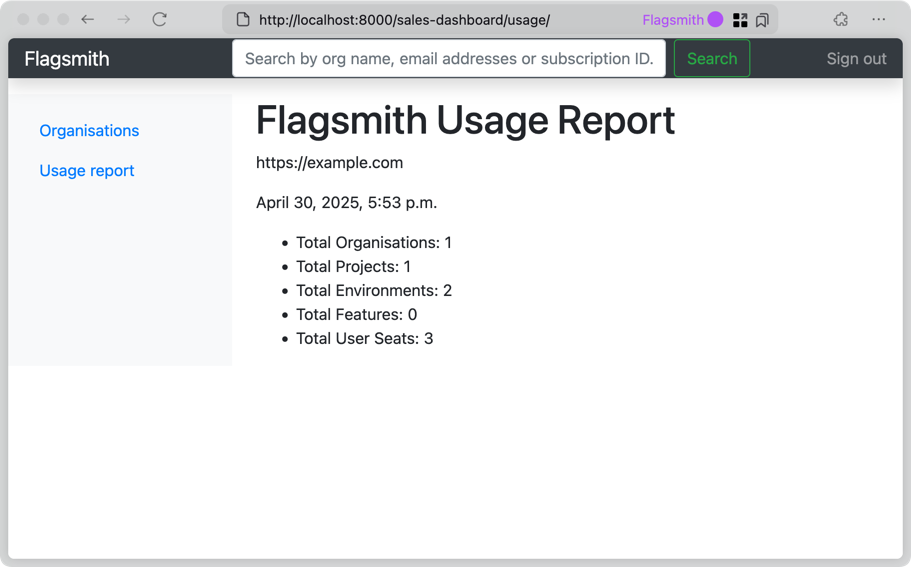

When you self-host Flagsmith, we may ask you to occasionally send us a report of your instance's usage.
This helps us understand how you are using Flagsmith and if your subscription is a good fit for you.

## Obtaining a report

To obtain a usage report, you need a user with staff permissions. This is the same type of user needed to access
[Django Admin](django-admin.md).

1. Browse to `/sales-dashboard/` relative to your Flagsmith API.
2. Log in with your staff user credentials.
3. Click "Usage report" on the navigation sidebar.
4. Copy the contents of this page and share it with the Flagsmith team.

## Example report

