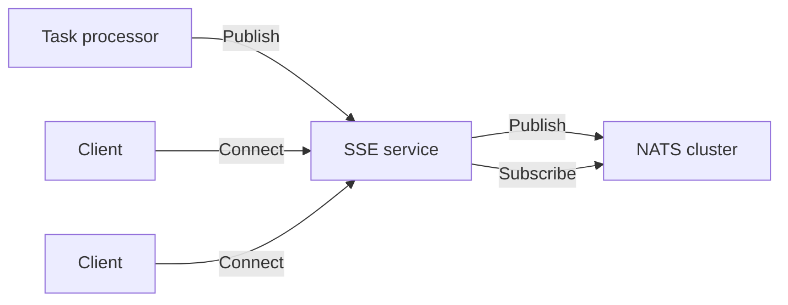
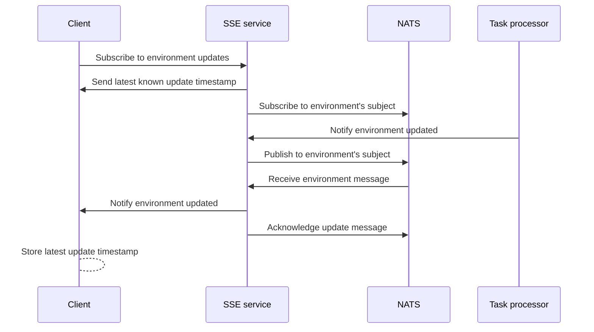

If you are self-hosting Flagsmith, using [real-time flag updates](/advanced-use/real-time-flags.md) requires you to
deploy additional infrastructure. This guide explains how to deploy, scale and monitor the infrastructure required for
using real-time flags.

## Prerequisites

Real-time flag updates require an Enterprise subscription.

We assume you already have the [Flagsmith API](/deployment/hosting/locally-api.md) running on your infrastructure.

## Infrastructure

Real-time flags require additional infrastructure that your Flagsmith deployment will use:

- **Server-sent events (SSE) service containers**, running the private
  [`flagsmith/sse`](https://hub.docker.com/repository/docker/flagsmith/sse) Docker image (tag `v4.0.0-beta` or later).
  These serve the real-time endpoint that Flagsmith clients can connect to.
- A **[NATS](https://docs.nats.io/)** cluster with [JetStream](https://docs.nats.io/nats-concepts/jetstream) persistent
  storage, which guarantees at-least-once delivery for updates.
  [What is NATS\?](https://docs.nats.io/nats-concepts/what-is-nats)

This diagram shows how all the components initiate connections to each other:



The task processor publishes to the SSE service instead of NATS to support a previous architecture for real-time flags
that did not use NATS. We may add the option to have the task processor or Flagsmith API publish directly to NATS in the
future.

## How it works

Real-time flags use a fully distributed and horizontally scalable architecture. Any SSE service instance or NATS server
can respond to any client's request. All components can be scaled out or in as needed. Stateful or sticky sessions are
not used.

The following sequence diagram shows how a Flagsmith client application connects to the real-time updates stream and
receives messages when the environment is updated.



### SSE service

The **server-sent events (SSE)** service provides the real-time API endpoints that Flagsmith clients connect to. Clients
connect to any service instance and hold an HTTP connection open for as long as they want to receive updates over SSE.

This service also accepts HTTP requests from the Flagsmith task processor to get notified of environment updates. NATS
is used as the messaging system to ensure these updates are distributed to clients.

[HTTP/2 is recommended](https://developer.mozilla.org/en-US/docs/Web/API/Server-sent_events/Using_server-sent_events)
for client connections, especially if the clients are web browsers. h2c (HTTP/2 over plaintext TCP) is supported, but
TLS is strongly recommended for performance and security.

### NATS

NATS persists a subject for each environment using a JetStream stream. SSE service instances subscribe and publish to
these subjects and fan out the updates over SSE to the relevant connected clients.

Persistent storage is required to guarantee at-least-once delivery. In practice, this is very little storage as messages
are small (~100 bytes) and persist in the stream for a short time.

While NATS can function without persistent storage, the SSE service requires it. This allows us to support use cases
such as emergency circuit breakers with higher reliability than if we were using only Core NATS, and mitigates the
impact of any SSE instance suddenly becoming unavailable.

<details>

<summary>

What does "at-least-once delivery" mean exactly?

</summary>

NATS provides an at-least-once delivery guarantee only for the SSE service. If NATS acknowledges a write, all SSE
service instances with clients subscribed to that environment are guaranteed to eventually receive the update at least
once. This guarantee does not extend to the clients of the SSE service.

Each SSE service instance creates one NATS consumer per connected client. Messages are acknowledged to NATS only if the
SSE service was able to write out the response for that client over TCP. This does not guarantee that the client
actually received the message, e.g. if intermediate proxies accept these messages but do not deliver them to clients.

</details>

## How to deploy

### NATS with JetStream

First, deploy NATS with JetStream enabled. NATS nodes can be deployed in
[many different ways](https://docs.nats.io/nats-concepts/overview). If you don't require high availability for real-time
flags, a single NATS can support tens of thousands of clients.

The only required configuration is to enable [JetStream](https://docs.nats.io/nats-concepts/jetstream). In the
[NATS Helm chart](https://github.com/nats-io/k8s/tree/main/helm/charts/nats), set `config.jetstream` to `true`.

If you are using the [NATS CLI](https://github.com/nats-io/natscli), use the `-js` or `--jetstream` flag:

```
nats-server --jetstream
```

See the [JetStream docs](https://docs.nats.io/running-a-nats-service/configuration/resource_management) for more
details.

### API and task processor

The Flagsmith API and task processor need to know about the SSE service. On both the API and task processor, set these
environment variables:

- `SSE_SERVER_BASE_URL` points to the SSE service load balancer. For example: http://my-sse-service:8088
- `SSE_AUTHENTICATION_TOKEN` can be set to any non-empty string, as long as the SSE service and task processor share the
  same value.

### SSE service

Run the `flagsmith/sse:v4.0.0-beta` image using the environment variables described in this guide.

### Flagsmith configuration

Make sure the Flagsmith projects you are updating have real-time updates enabled. If not, no tasks will be queued when
its environments are updated.

Lastly, client applications should set their Flagsmith SDK's realtime endpoint URL to the base URL of the SSE service.

## Security

Subscribing to real-time updates via the SSE service does not require authentication. The SSE service allows all CORS
requests on all endpoints.

The task processor authenticates with the SSE service when publishing an update by using a shared secret. This secret is
configured using the `SSE_AUTHENTICATION_TOKEN` environment variable. For example:

```
curl -X POST -H "Authorization: Token ..." -H "Content-Type: application/json" -d'{"updated_at":123}' http://localhost:8088/sse/environments/abcxyz/queue-change
```

In most cases, the `/queue-change` endpoint can be exposed only to the Flagsmith cluster and not client applications.

### NATS

If NATS is not used by other applications and is not exposed to the network, the default security settings for NATS
(allow publishing or subscribing to any subject without authentication) will be sufficient for most use cases.

You can configure NATS to
[require authentication](https://docs.nats.io/running-a-nats-service/configuration/securing_nats/auth_intro). The SSE
can only authenticate using URL-based methods.
[Token authentication](https://docs.nats.io/running-a-nats-service/configuration/securing_nats/auth_intro/tokens) is the
simplest method if you don't have other requirements.

One NATS subject is used per environment with the format `flagsmith.environment.YOUR_ENVIRONMENT_ID`.

JetStream only stores the last-update timestamp for each environment for a limited time, so encryption at rest is
typically not required.

## Performance and scaling

The performance of real-time flags will depend mainly on these factors:

- Where your clients are connecting to the SSE service from
- How many clients are connecting to each SSE service instance
- How many clients are being notified by any given environment update
- How often environments with active subscribers are updated

### Reliability

If an environment was updated in the past hour, any client that subscribes to it using the SSE service will immediately
receive the latest update timestamp. This means that SSE service instances can be replaced as needed without updates
being lost, assuming client applications can reconnect. Flagsmith SDKs will try to reconnect by default.

All NATS subscriber and publisher state is persisted, so NATS nodes can also be replaced as needed without coordination.
At least one healthy NATS node is required at all times.

The SSE service sends a keep-alive message every 15 seconds if nothing was sent to prevent load balancers, NAT gateways
or other proxies from closing an inactive connection.

### Latency

The goal is to minimise **end-to-end latency**, which is the time taken between the Flagsmith API acknowledging an
environment update, and a client getting notified of this update over SSE. Ignoring network delays, this will mainly
depend on:

- How often the [task processor](https://docs.flagsmith.com/deployment/configuration/task-processor) is polling the API
  for new tasks (by default 2 seconds)
- How long the "environment updated" tasks take to execute (varies on task processor and database load)
- How fast NATS can acknowledge the update (usually milliseconds)
- How fast NATS can notify all relevant SSE instances (usually milliseconds)
- How fast the SSE service can get updates from NATS and notify its subscribers (usually milliseconds, depending on
  load)

### Storage

The SSE service does not require persistent storage.

NATS stores a timestamp of when each environment was last updated. This timestamp is persisted for about an hour to
allow updates to distribute while limiting resource usage. In-memory storage is preferred when possible, though some
state is always persisted by JetStream such as Raft consensus data.

NATS persistent data does not need to be backed up. Solid-state storage might help end-to-end latency under high load
but is typically not required.

### Monitoring

Make sure you are [monitoring the task processor](/deployment/configuration/task-processor#monitoring), as the SSE
service depends on it.

The SSE service exposes two health check endpoints, which can be used for liveness and readiness checks:

- `GET /livez` responds with 200 if the SSE service can accept incoming connections.
- `GET /readyz` responds with 200 if the SSE service is available and connected to NATS. This only checks the internal
  NATS connection state and does not generate NATS traffic.

NATS provides its own [tools for monitoring](https://docs.nats.io/running-a-nats-service/nats_admin/monitoring).

### Metrics

TODO: The following is not implemented!

The SSE service exposes the following Prometheus metrics at the `/metricsz` endpoint:

- `flagsmith_sse_subscribers`: number of active subscribers
- `flagsmith_sse_subscribers_total`: total number of subscribers
- `flagsmith_sse_http_errors_total`, with labels `message=keepalive|data|healthcheck`
- `flagsmith_sse_http_writes_total`, with labels `message=keepalive|data|healthcheck`
- `flagsmith_sse_nats_errors_total`, with labels
  `operation=connect|publish|create_jetstream|create_consumer|pull|read|ack`

We provide a Grafana dashboard for these metrics.

NATS also provides a Grafana dashboard and can be configured to
[expose Prometheus metrics](https://github.com/nats-io/prometheus-nats-exporter/blob/main/walkthrough/README.md).

### Benchmarking

The SSE service is constrained by:

- The number of open HTTP connections it can keep open at the same time (memory, sockets)
- The number of subscribers that will receive a message after an update (CPU and network)

An 11-core M3 MacBook Pro with 18 GB of memory can support at least 15.000 concurrent subscribers with simultaneous
publishing at ~1 second latency, constrained by the number of open sockets. This was tested with a
[k6 script](./real-time/benchmark.js) that opens many subscriptions to one environment on the SSE service while pushing
updates to that environment.

You can monitor the load test while it's running by connecting to the SSE service as another subscriber:

```
$ curl -H "Accept:text/event-stream" -N -i http://localhost:8088/sse/environments/load_test/stream
HTTP/1.1 200 OK
Cache-Control: no-cache
Connection: keep-alive
Content-Type: text/event-stream
Date: Mon, 09 Dec 2024 16:20:00 GMT
Transfer-Encoding: chunked

data: {"updated_at":1}

data: {"updated_at":2}
```

The `queue-change` endpoint can achieve at least 20.000 requests per second on the same hardware.

If you want to benchmark NATS itself, you can use its
[first-party benchmarking tools](https://docs.nats.io/using-nats/nats-tools/nats_cli/natsbench).

## How to use it

The `flagsmith/sse` service provides the following HTTP endpoints:

| Method | Route                                          | Called by           | Description                                                    | Authentication             |
| ------ | ---------------------------------------------- | ------------------- | -------------------------------------------------------------- | -------------------------- |
| GET    | `/sse/environments/{environment}/stream`       | Client applications | Subscribe to an SSE stream for the given environment.          | None                       |
| POST   | `/sse/environments/{environment}/queue-change` | Task processor      | Notify the SSE service that the given environment was updated. | `SSE_AUTHENTICATION_TOKEN` |

The stream protocol is described in the
[documentation for real-time flag updates](/advanced-use/real-time-flags#implementation-details).

### Configuration

`flagsmith/sse` uses the following environment variables for configuration:

| Variable name              | Description                                                      | Default                 |
| -------------------------- | ---------------------------------------------------------------- | ----------------------- |
| `NATS_URL`                 | URL of any NATS node                                             | `nats://127.0.0.1:4222` |
| `LISTEN_ADDR`              | Addresses to listen for HTTP connections on                      | `:8080`                 |
| `SSE_AUTHENTICATION_TOKEN` | Shared secret for authentication on the `/queue-change` endpoint | **Required**            |
