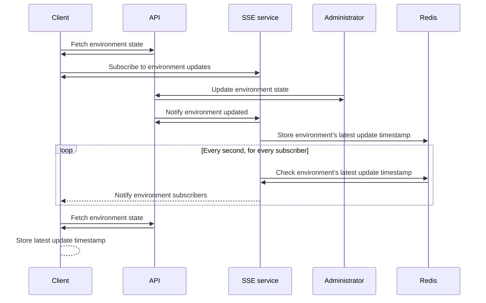

If you are self-hosting Flagsmith, using [real-time flag updates](/advanced-use/real-time-flags.md) requires deploying
additional infrastructure. This document describes how to deploy, scale and monitor the infrastructure required for
using real-time flags.

## Prerequisites

Real-time flag updates require an Enterprise subscription.

This document assumes you already have the [Flagsmith API](/deployment/hosting/locally-api.md) deployed to your
infrastructure.

## Limitations

The [Flagsmith Helm chart](/deployment/hosting/kubernetes) does not support deploying the infrastructure required for
real-time flag updates.

The Redis server must not require authentication for the `default` user.

## Architecture

Self-hosting real-time flags requires two additional infrastructure components:

- Server-sent events (SSE) service containers, running the `flagsmith/sse` Docker image.
- Redis or Redis-compatible key-value store, such as Valkey. All
  [currently-supported Redis versions](https://redis.io/docs/latest/operate/rs/installing-upgrading/product-lifecycle/)
  are supported.

The following sequence diagram describes how Flagsmith clients, the Flagsmith API and real-time components interact to
deliver real-time flag updates. "Client" refers to any Flagsmith SDK that supports real-time updates.

```mermaid
sequenceDiagram
    Client->>API: Fetch environment state
    API->>Client: #nbsp
    Client->>SSE service: Subscribe to environment updates
    SSE service->>Client: #nbsp
    Administrator->>API: Update environment state
    API->>Administrator: #nbsp
    API->>SSE service: Notify environment updated
    SSE service->>API: #nbsp
    SSE service->>Redis: Store environment's latest update timestamp
    loop Every second, for every subscriber
        SSE service->>Redis: Check environment's latest update timestamp
        Redis->>SSE service: #nbsp
        SSE service-->>Client: Notify environment subscribers
    end
    Client->>API: Fetch environment state
    API->>Client: #nbsp
    Client-->Client: Store latest update timestamp
```

## Server-sent events (SSE) service

The `flagsmith/sse` service provides the following HTTP endpoints:

| Method | Route                                          | Called by           | Description                                                    | Authentication             |
| ------ | ---------------------------------------------- | ------------------- | -------------------------------------------------------------- | -------------------------- |
| GET    | `/sse/environments/{environment}/stream`       | Client applications | Subscribe to an SSE stream for the given environment.          | None                       |
| POST   | `/sse/environments/{environment}/queue-change` | Flagsmith API       | Notify the SSE service that the given environment was updated. | `SSE_AUTHENTICATION_TOKEN` |

### Configuration

`flagsmith/sse` uses the following environment variables for configuration:

| Variable name | Description                                 | Default      | Example     |
| ------------- | ------------------------------------------- | ------------ | ----------- |
| `REDIS_HOST`  | Hostname of the Redis server to use to      | **Required** | `localhost` |
| `REDIS_PORT`  | Port number to use when connecting to Redis |              |             |
