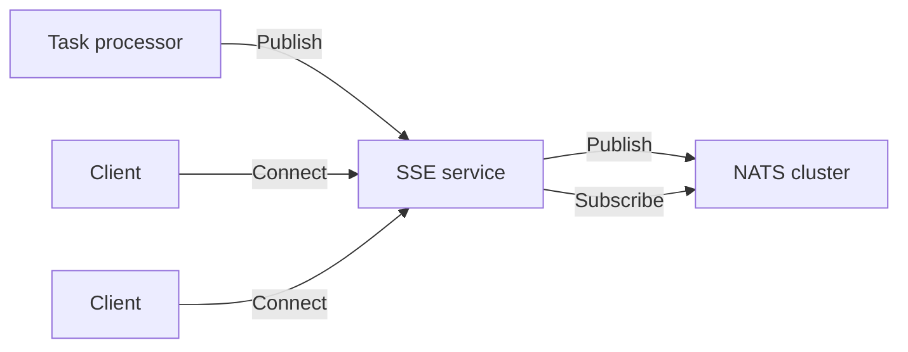
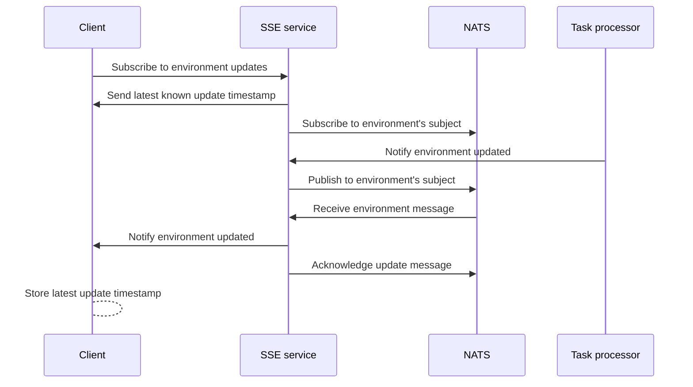

If you are self-hosting Flagsmith, using [real-time flag updates](/advanced-use/real-time-flags.md) requires you to
deploy additional infrastructure. Start here for an overview of how this infrastructure delivers this capability in your
self-hosted Flagsmith.

You might also be interested in:

- [How to deploy the infrastructure for real-time flag updates](deployment)
- [How to operate a real-time flag updates system](operations)

## Prerequisites

Real-time flag updates require an Enterprise subscription.

We assume you already have the [Flagsmith API](/deployment/hosting/locally-api.md) running on your infrastructure.

## Infrastructure

The **real-time flag updates system** is supported by additional infrastructure that your existing Flagsmith deployment
integrates will use:

- **Server-sent events (SSE) service containers**, running the private
  [`flagsmith/sse`](https://hub.docker.com/repository/docker/flagsmith/sse) Docker image (tag `v4.0.0-beta` or later).
  These serve the real-time endpoint that Flagsmith clients can connect to, and receive updates from the
  [task processor](/deployment/configuration/task-processor).
- A **[NATS](https://docs.nats.io/)** cluster with [JetStream](https://docs.nats.io/nats-concepts/jetstream) persistent
  storage, which guarantees at-least-once delivery for updates.
  [What is NATS\?](https://docs.nats.io/nats-concepts/what-is-nats)

This diagram shows how all the components initiate connections to each other:

The task processor publishes to the SSE service instead of NATS to support a previous architecture for real-time flags
that did not use NATS. We may add the option to have the task processor or Flagsmith API publish directly to NATS in the
future.

## How it works

Real-time flags use a fully distributed and horizontally scalable architecture. Any SSE service instance or NATS server
can respond to any client's request. All components can be scaled out or in as needed. Stateful or sticky sessions are
not used.

The following sequence diagram shows how a Flagsmith client application connects to the real-time updates stream and
receives messages when the environment is updated.

### SSE service

The **server-sent events (SSE)** service provides the real-time API endpoints that Flagsmith clients connect to. Clients
connect to any service instance and hold an HTTP connection open for as long as they want to receive updates over SSE.

This service also accepts HTTP requests from the Flagsmith task processor to get notified of environment updates. NATS
is used as the messaging system to ensure these updates are distributed to clients.

[HTTP/2 is recommended](https://developer.mozilla.org/en-US/docs/Web/API/Server-sent_events/Using_server-sent_events)
for client connections, especially if the clients are web browsers. h2c (HTTP/2 over plaintext TCP) is supported, but
TLS is strongly recommended for performance and security.

### NATS

NATS persists a subject for each environment using a JetStream stream. SSE service instances subscribe and publish to
these subjects and fan out the updates over SSE to the relevant connected clients.

Persistent storage is required to guarantee at-least-once delivery. In practice, this is very little storage as messages
are small (~100 bytes) and persist in the stream for a short time.

While NATS can function without persistent storage, the SSE service requires it. This allows us to support use cases
such as emergency circuit breakers with higher reliability than if we were using only Core NATS, and mitigates the
impact of any SSE instance suddenly becoming unavailable.

What does "at-least-once delivery" mean exactly?

NATS provides an at-least-once delivery guarantee only for the SSE service. If NATS acknowledges a write, all SSE
service instances with clients subscribed to that environment are guaranteed to eventually receive the update at least
once. This guarantee does not extend to the clients of the SSE service.

Each SSE service instance creates one NATS consumer per connected client. Messages are acknowledged to NATS only if the
SSE service was able to write out the response for that client over TCP. This does not guarantee that the client
actually received the message, e.g. if intermediate proxies accept these messages but do not deliver them to clients.

## How to use it

The `flagsmith/sse` service provides the following HTTP endpoints:

| Method | Route                                          | Called by           | Description                                                    | Authentication                   |
| ------ | ---------------------------------------------- | ------------------- | -------------------------------------------------------------- | -------------------------------- |
| GET    | `/sse/environments/{environment}/stream`       | Client applications | Subscribe to an SSE stream for the given environment.          | None                             |
| POST   | `/sse/environments/{environment}/queue-change` | Task processor      | Notify the SSE service that the given environment was updated. | `Token SSE_AUTHENTICATION_TOKEN` |

The stream protocol is described in the
[documentation for real-time flag updates](/advanced-use/real-time-flags#implementation-details).
