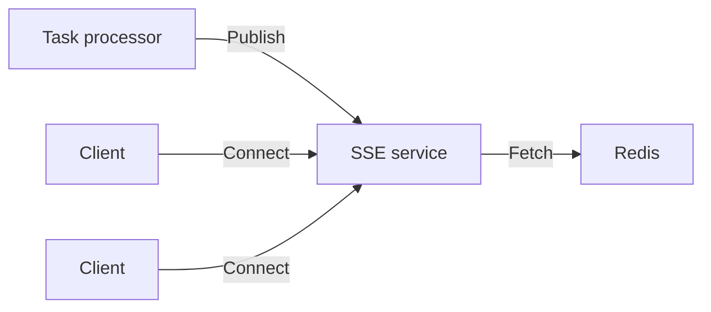
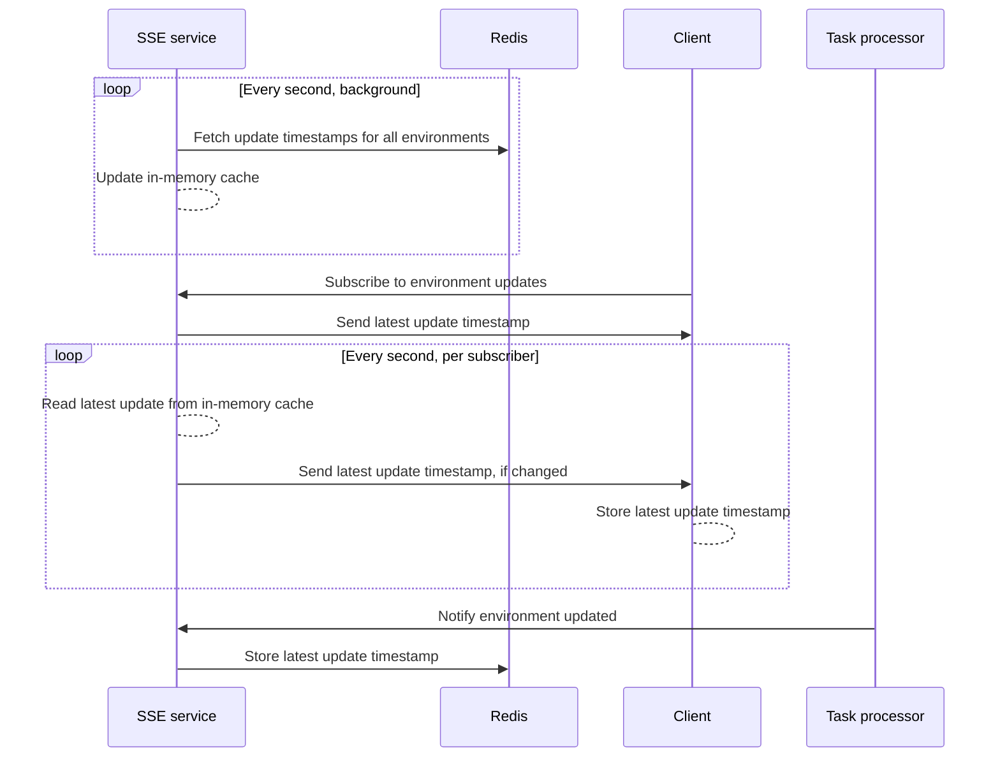

If you are self-hosting Flagsmith, using [real-time flag updates](/advanced-use/real-time-flags.md) requires you to
deploy additional infrastructure. Start here for an overview of how this infrastructure delivers this capability in your
self-hosted Flagsmith.

You might also be interested in:

- [How to deploy the infrastructure for real-time flag updates](deployment)
- [How to operate a real-time flag updates system](operations)

## Prerequisites

Real-time flag updates require an Enterprise subscription.

We assume you already have the [Flagsmith API](/deployment/hosting/locally-api.md) running on your infrastructure.

## Infrastructure

The **real-time flag updates system** is supported by additional infrastructure that your existing Flagsmith deployment
integrates with:

- **Server-sent events (SSE) service containers**, running the private
  [`flagsmith/sse`](https://hub.docker.com/repository/docker/flagsmith/sse) Docker image. These serve the real-time
  endpoint that Flagsmith clients can connect to, and receive updates from the
  [task processor](/deployment/configuration/task-processor).
- A Redis-compatible key-value store that the [task processor](/deployment/configuration/task-processor.md) and SSE
  service can connect to.

This diagram shows how all the components initiate connections to each other:

## How it works

Real-time flags use a fully distributed and horizontally scalable architecture. Any SSE service instance can respond to
any client's request. All components can be scaled out or in as needed. Stateful or sticky sessions are not used.

The following sequence diagram shows how a Flagsmith client application connects to the real-time updates stream and
receives messages when the environment is updated.

### SSE service

The **server-sent events (SSE)** service provides the real-time API endpoints that Flagsmith clients connect to. Clients
connect to any service instance and hold an HTTP connection open for as long as they want to receive updates over SSE.

This service also accepts HTTP requests from the Flagsmith task processor to get notified of environment updates. Redis
is used as the storage layer to distribute these updates to clients.

[HTTP/2 is recommended](https://developer.mozilla.org/en-US/docs/Web/API/Server-sent_events/Using_server-sent_events)
for client connections, especially if the clients are web browsers.

### Redis

Redis stores a key for each environment containing a timestamp of when it was last updated. SSE service instances will
periodically fetch all environment's keys and cache them in memory. This cache is used to publish update notifications
to connected clients.

If Redis or its stored data are unavailable, clients will not be able to receive updates.

## How to use it

Refer to the [deployment guide](deployment) for instructions on setting up the required infrastructure.

The `flagsmith/sse` service provides the following HTTP endpoints:

| Method | Route                                          | Called by           | Description                                                    | Authentication                   |
| ------ | ---------------------------------------------- | ------------------- | -------------------------------------------------------------- | -------------------------------- |
| GET    | `/sse/environments/{environment}/stream`       | Client applications | Subscribe to an SSE stream for the given environment.          | None                             |
| POST   | `/sse/environments/{environment}/queue-change` | Task processor      | Notify the SSE service that the given environment was updated. | `Token SSE_AUTHENTICATION_TOKEN` |

The stream protocol is described in the
[documentation for real-time flag updates](/advanced-use/real-time-flags#implementation-details).
