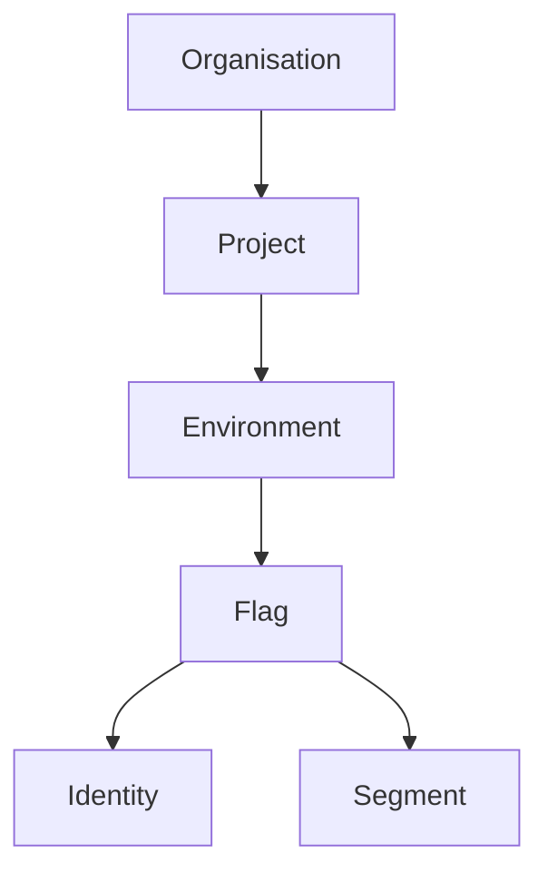

# How the Data Model Works

- **Organisations** are the highest level, letting you manage multiple teams or companies in one Flagsmith instance.
- Each **Organisation** contains one or more **Projects**. Projects are used to group related features, environments, and teams.
- **Environments** (like Development, Staging, Production) let you manage different flag states and values for each deployment context.
- **Flags** are the core of feature management. You can enable/disable them, assign values, and target them to users or segments.
- **Identities** represent individual users or devices, allowing you to override flag values for specific people or groups.
- **Segments** let you define rules to target groups of identities, such as "beta testers" or "premium users".

For example, you might:
- Enable a new feature for only your internal team (a segment) in the Staging environment.
- Roll out a feature to 10% of users in Production by targeting a segment with a percentage rule.
- Override a flag for a specific user (identity) to help with troubleshooting.

| Entity         | Description |
|----------------|-------------|
| **Organisation** | The top-level entity, usually your company or team. |
| **Project**      | Contains a set of related feature flags and environments. |
| **Environment**  | Represents a deployment context (e.g., Development, Production). Each project can have multiple environments. |
| **Flag**         | A feature flag that can be toggled on or off, or assigned a value. |
| **Identity**     | Represents a user or device, allowing for individual flag overrides. |
| **Segment**      | A group of identities defined by rules, for targeting features to specific users. |

This structure allows you to manage features flexibly and safely across your entire application lifecycle.

For definitions of these terms, see the [Glossary](./glossary.md). For a practical example, try [Create Your First Flag](./create-your-first-flag.md).

