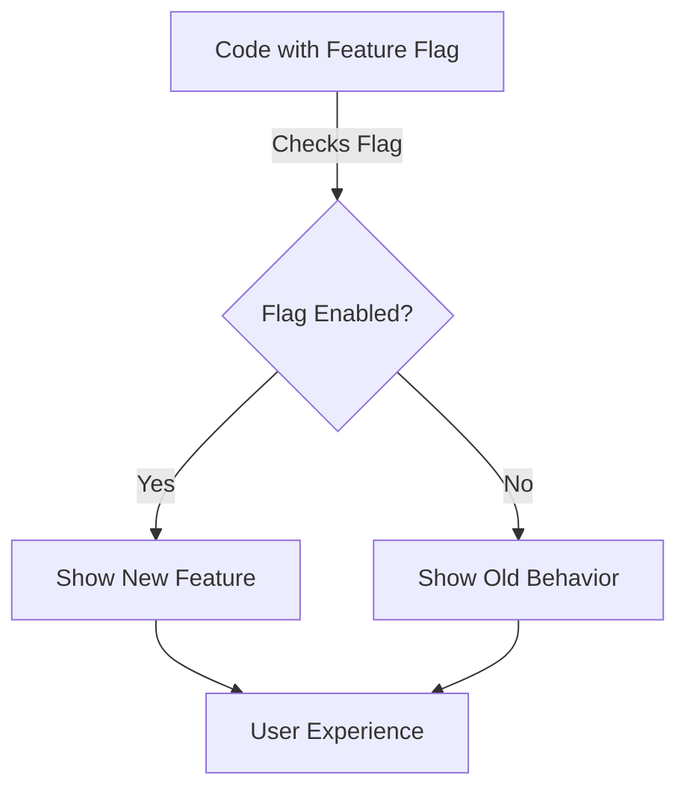

# Feature Flags

Feature flags (also known as feature toggles) are a powerful technique that allows you to enable or disable features in your application without deploying new code. They help you:

- Release features gradually (canary or staged rollouts)
- Test features in production
- Run A/B or multivariate experiments
- Instantly disable problematic features (kill switches)
- Decouple deployment from release

Flagsmith makes it easy to manage feature flags across multiple environments and projects.

## How Feature Flags Work

A feature flag is a conditional check in your code that determines whether a feature is enabled or disabled. This check can be controlled remotely, allowing you to change application behavior without redeploying code.

## Feature Flag Lifecycles

Feature flags can be short-lived (for rollouts and experiments) or long-lived (for ongoing control, like kill switches). Learn more in the [Feature Flag Lifecycle Guide](/guides-and-examples/flag-lifecycle).

## Best Practices

- Use clear naming conventions for your flags
- Remove short-lived flags when no longer needed
- Document the purpose of each flag
- Set default values for all flags ([Defensive Coding](/guides-and-examples/defensive-coding))
- Use tags and owners to organize and manage flags ([Flag Management](/advanced-use/flag-management))

