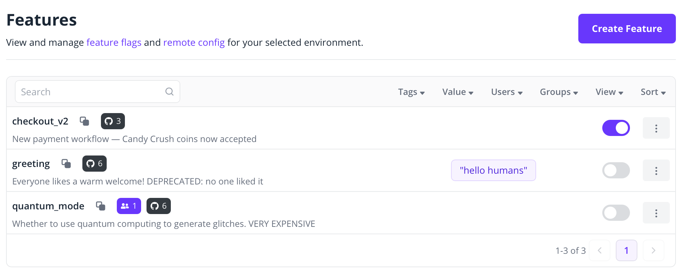
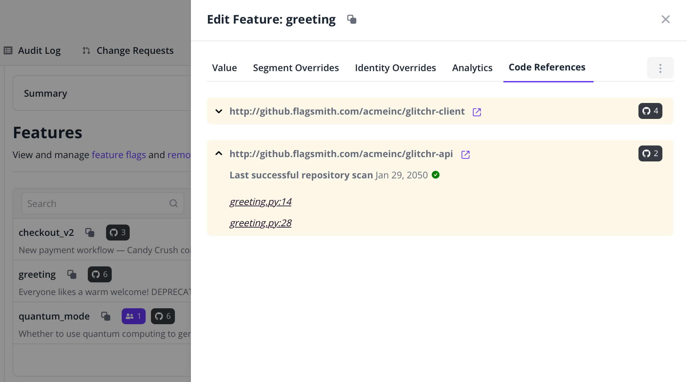

Integrate with Code References to track feature flag usage in your codebase, and unlock new functionality in Flagsmith:

- Identify the impact of each feature across multiple repositories
- Navigate through the business logic in the code from a feature's perspective
- Coordinate cleanup work around stale feature flags easier



<p style={{textAlign: 'center', fontSize: '0.9em', color: 'gray', marginTop: '-1.5rem'}}>Code Reference counts displayed in Features list</p>

:::info

We currently only offer integrating with GitHub. Support to other VCS platforms is coming soon.

:::

---

## Integrate with GitHub

### Simple configuration

For most cases, our [reusable workflow](https://github.com/Flagsmith/ci/blob/main/.github/workflows/collect-code-references.yml) is enough.

Add a new GitHub Actions workflow to **each repository** to integrate with Code References:

```yaml
# .github/workflows/flagsmith-code-references.yml
name: Flagsmith Code references
on:
  push:
    branches:
      - main  # Update references on every update to the default branch
jobs:
  collect-code-references:
    name: Collect
    uses: Flagsmith/ci/.github/workflows/collect-code-references.yml@v1.0.0
    permissions:
      contents: read  # For scanning feature flag code references
    with:
      flagsmith_project_id: ${{ fromJSON(vars.FLAGSMITH_PROJECT_ID) }}
      flagsmith_admin_api_url: https://api.flagsmith.com  # Or your Flagsmith instance URL
    secrets:
      flagsmith_admin_api_key: ${{ secrets.FLAGSMITH_CODE_REFERENCES_API_KEY }}
```

This workflow needs the following added to [_Settings > Secrets and variables > Actions_](https://docs.github.com/en/actions/security-for-github-actions/security-guides/using-secrets-in-github-actions) in GitHub:

- `FLAGSMITH_PROJECT_ID` (variable): obtain from the Flagsmith dashboard URL, e.g. `/project/<id>/...`
- `FLAGSMITH_CODE_REFERENCES_API_KEY` (secret): obtain from _Organisation Settings > API Keys_ in Flagsmith

### Advanced configuration

If you need a customised workflow, integrating with individual actions is also possible. They can be useful to certain use cases, for example:

- Customising cloning source code for reference scanning
- Combining multiple repositories into a single workflow (umbrella repositories)
- Any other customisation of the integration steps

```yaml
name: Flagsmith Code References
on:
  push:
    branches:
      - main
jobs:
  collect-code-references:
    name: Collect code references
    runs-on: ubuntu-latest
    permissions:
      contents: read  # For scanning feature flag code references
    env:
      FLAGSMITH_ADMIN_API_URL: https://api.flagsmith.com  # Or your Flagsmith instance URL
    steps:
      - name: Checkout code
        uses: actions/checkout@v4

      - name: Fetch feature names
        id: fetch-feature-names
        uses: Flagsmith/ci/.github/actions/fetch-feature-names@v1.0.0
        with:
          flagsmith_project_id: ${{ vars.FLAGSMITH_PROJECT_ID }}
          flagsmith_admin_api_url: ${{ env.FLAGSMITH_ADMIN_API_URL }}
          flagsmith_admin_api_key: ${{ secrets.FLAGSMITH_CODE_REFERENCES_API_KEY }}

      - name: Scan code references
        id: scan-code-references
        uses: Flagsmith/ci/.github/actions/scan-code-references@v1.0.0
        with:
          feature_names: ${{ steps.fetch-feature-names.outputs.feature_names }}

      - name: Upload code references
        uses: Flagsmith/ci/.github/actions/upload-code-references@v1.0.0
        with:
          code_references: ${{ steps.scan-code-references.outputs.code_references }}
          flagsmith_project_id: ${{ vars.FLAGSMITH_PROJECT_ID }}
          flagsmith_admin_api_url: ${{ env.FLAGSMITH_ADMIN_API_URL }}
          flagsmith_admin_api_key: ${{ secrets.FLAGSMITH_CODE_REFERENCES_API_KEY }}
          repository_url: ${{ github.server_url }}/${{ github.repository }}
          revision: ${{ github.sha }}
```

This workflow needs the following added to [_Settings > Secrets and variables > Actions_](https://docs.github.com/en/actions/security-for-github-actions/security-guides/using-secrets-in-github-actions) in GitHub:

- `FLAGSMITH_PROJECT_ID` (variable): obtain from the Flagsmith dashboard URL, e.g. `/project/<id>/...`
- `FLAGSMITH_CODE_REFERENCES_API_KEY` (secret): obtain from _Organisation Settings > API Keys_ in Flagsmith

---

## How it works

Code References rely on CI scripts isolated to three steps:

1. Fetch feature names from Flagsmith (communicates with Flagsmith API)
2. Scan code references for the project's features (**does not** communicate with Flagsmith API)
3. Upload code references to Flagsmith (communicates with Flagsmith API)

:::important

Integrating with Code References **does not** expose your source code to Flagsmith. Our API only collects file paths, and line numbers, of code locations likely containing a feature flag evaluation. Code scanning is performed locally on the CI runner.

:::

Feature details will expand on the _Code References_ tab, and list locations of each code reference:



## Related

- [Admin API Authentication](/integrating-with-flagsmith/flagsmith-api-overview/admin-api/authentication): Generate API keys for Code References
- [Flag Lifecycle](/best-practices/flag-lifecycle): Learn when to remove short-lived flags from your code
