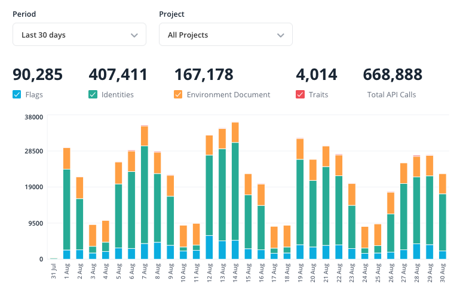

When you use Flagsmith on Flagsmith-managed infrastructure (SaaS or private cloud), your pricing plan has a limit of API
requests per month. This document describes how these limits work, and how to estimate how many API requests your
applications will need.

:::tip

Self-hosted Flagsmith installations do not have API request limits.

:::

## How can I check my current usage?

To check your API usage for the past 90 days:

1. Log in to the Flagsmith dashboard as an organisation administrator.
2. Click on your organisation name in the top left.
3. Browse to the **Usage** tab.

From this page, you can break down usage per project and per environment.

The following screenshot shows an example usage graph from the Flagsmith dashboard:

## What counts as an API request?

Any operation that calls Flagsmith's API to retrieve information about the current state of flags counts as 1 billable
API request.

The billable API requests your application makes depends mainly on which [flag evaluation mode](/clients) it uses:

-   Remote Evaluation is the default for all applications. Applications using Remote Evaluation call the Flagsmith API
    when they need to fetch the flags for the current environment or user.
-   Local Evaluation is optional, and only for server-side applications. Each individual application or
    [Edge Proxy](/advanced-use/edge-proxy) instance polls the Flagsmith API at a configurable interval (60 seconds by
    default) to fetch the flags for the current environment and all users in one API request.

The following requests are not billable:

-   [Admin API](/clients/rest#private-admin-api-endpoints) requests.
-   Requests made by Flagsmith SDKs to track [Flag Analytics](/advanced-use/flag-analytics).
-   Connecting to a [real-time flag updates](/advanced-use/real-time-flags) stream.

### Example: client-side application

Consider a website or mobile application that can be used by anonymous or authenticated users. A typical session would
look like this:

1. A user visits the application for the first time. The user's device calls Flagsmith to get the flags for the
   production environment (1 API request).
2. The user logs in to their account. Now that we know the user's identity, their device calls Flagsmith to get the
   flags for this specific user, taking into account their
   [A/B tests or progressive rollouts](/advanced-use/ab-testing), [segments](/basic-features/segments) and user-specific
   flags (1 API request). Any user data sent by your application is stored by Flagsmith as traits.
3. The user performs some action that should update their stored data in Flagsmith. The device calls Flagsmith to update
   this user's traits and receives their latest flags in return (1 API request).

Because these API requests were made using Remote Evaluation, they would all send data to any analytics
[integrations](/integrations/) you may have configured.

Client-side SDKs optionally support caching and polling depending on how fresh your application needs its flags to be.

Following the example above, suppose your application caches flags for 10 minutes, with each session lasting 20 minutes
on average. You could estimate your monthly API usage as:

> **Monthly sessions** × (**2 flag updates per session** + **3 flag requests per session**)

### Example: server-side application

Consider a service that can serve requests for anonymous or unauthenticated users. If the service uses Local Evaluation,
its lifecycle could look like this:

1. A service instance starts up and starts polling Flagsmith to retrieve its environment definition (1 API request per
   minute per instance)
2. A request for an anonymous user arrives. The service uses its environment definition stored in memory and responds
   (no API requests consumed).
3. A request for an authenticated user arrives:
    1. The service retrieves any user information required to evaluate their flags from their session/token, or from an
       external service.
    2. The service's Flagsmith SDK uses the current environment definition stored in memory to calculate the flags for
       this user based on the traits retrieved in the previous step (no API requests consumed).

"Service" in this context refers to any of the following:

-   An instance of your application, running in a container or server, using the Flagsmith SDK with Local Evaluation
    enabled.
-   An [Edge Proxy](/advanced-use/edge-proxy) container instance.

Following the example above, if you used the default polling frequency of 60 seconds, you could estimate your monthly
API usage as:

> **Number of service instances** × **43,200 polls per month**

## What happens if I exceed my API call limit?

If you exceed your API call limit, your account may be blocked or charged for overages depending on your pricing plan.
For more details, see [Traffic Limits](/system-administration/system-limits#traffic-limits).

Accounts on paid plans are never blocked automatically.
