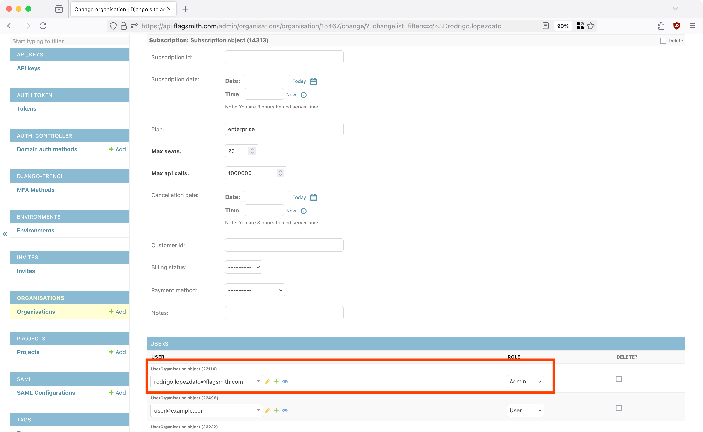

You can import and export an entire Flagsmith organisation. This lets you:

* Migrate from self-hosted Flagsmith to SaaS, or the other way around.
* Migrate from one self-hosted Flagsmith instance to another.

:::note

Merging data between existing Flagsmith organisations **is not** supported. A new Flagsmith organisation is created as
part of the import process.

:::

## Prerequisites

Importing or exporting an organisation requires shell access to any machine or container where Flagsmith is 
installed and can connect to your Flagsmith database.

Organisations can be imported or exported using the local file system or S3-compatible storage.

Importing or exporting an organisation does not require downtime. However, it is a one-time operation that does not
continuously migrate data. You should plan a convenient time to perform imports and exports.

**If you need to copy an organisation from or to Flagsmith SaaS, please contact Flagsmith support.**

## What is exported?

We **will** export the following entities:

- Projects
- Flags
- Segments
- Identities
- Integrations
- Client-side and server-side SDK keys

We **will not** export the following entities:

- Flagsmith users
- Flag analytics
- Audit logs
- Change requests
- Scheduled flag changes
- Admin API keys
- Groups and custom roles
- SAML configurations and login method restrictions

## Running shell commands

Importing or exporting is performed using shell commands on a Flagsmith container that has access to your Flagsmith 
database. You can also create a new container just for this operation.

<details>

<summary>Kubernetes</summary>

To run an interactive shell inside an existing API container, use `kubectl exec` replacing `YOUR_API_SERVICE` with the 
name of your Flagsmith API Kubernetes service:

```
kubectl exec -it service/YOUR_API_SERVICE --container flagsmith-api -- sh
```

To find your Flagsmith API Kubernetes service, you can use `kubectl get services`:

```
kubectl get services --selector app.kubernetes.io/component=api
```

Putting these two commands together, this one-liner will give you an interactive API shell:

```
kubectl exec -it  $(kubectl get service --selector app.kubernetes.io/component=api --output name) --container flagsmith-api -- sh
```

</details>

<details>

<summary>Docker Compose</summary>

Use `docker compose exec` to get an interactive shell inside your API container, replacing `flagsmith` with your 
Flagsmith API service name from your Compose definition:

```
docker compose exec -it flagsmith sh
```

</details>

<details>

<summary>SSH and local environments</summary>

If you have a shell inside a Flagsmith environment, check that you can run `python manage.py`. In containers running 
Flagsmith images, this file is located in the `/app` directory:

```
python /app/manage.py health_check
```

</details>

## Exporting

To export your Flagsmith organisation, you need to know its ID. To find an organisation's ID, use one of the 
following methods:

* From the Flagsmith dashboard, click your organisation name in the top left. The organisation ID is displayed in 
  the URL bar: `https://flagsmith.example.com/organisation/YOUR_ORGANISATION_ID/...`.
* From [Django Admin](/deployment/configuration/django-admin), browse to the Organisations section in the sidebar. 
  Here you can see all of your organisations and their IDs. 
* If you have an Admin API key, call the
  [List Organisations API endpoint](https://api.flagsmith.com/api/v1/docs/#/api/api_v1_organisations_list). This 
  returns all the organisations that your API key is a member of.

Once you have shell access and you know the organisation's ID, you can export it to the container's file system or 
S3-compatible storage.

### Exporting to the local file system

To export the organisation with ID 1234 to a JSON file in the local file system:

```bash
python manage.py dumporganisationtolocalfs 1234 /tmp/organisation-1234.json
```

Then, copy the exported JSON file to a secure location.

<details>

<summary>Kubernetes</summary>


From the same shell you exported the organisation from, run the `hostname` command to get the current pod name. For 
example:

```
$ hostname
flagsmith-api-59d68fd74d-4kw2k
```

Then, from a different machine, use `kubectl cp` to copy the exported file for further processing:

```
kubectl cp --container flagsmith-api YOUR_API_POD_NAME:/tmp/organisation-1234.json ~/organisation-1234.json
```

<h3>Read-only file systems</h3>

In some situations, you may not be able to write to `/tmp` or any directory in the container's root file system. If
this is the case, attach a writable volume to your API pods. For example, if you are using the Flagsmith Helm chart:

```yaml title="values.yaml"
api:
  extraVolumes:
    - name: exports
      emptyDir: {}
  volumeMounts:
    - name: exports
      mountPath: /exports
```

Then, export your organisation to this directory and copy it following the previous steps.

</details>

<details>

<summary>Docker</summary>

From the same shell you exported the organisation from, run the `hostname` command to get the container ID. For example:

```
$ hostname
6893461b8a7e
```

Then, from the host machine, copy the exported file from the container using `docker cp`. For example:

```
docker cp 6893461b8a7e:/tmp/organisation-1234.json .
```

</details>

### Exporting to S3-compatible storage

To export the organisation with ID 1234 to a key named `1234.json` in the S3 bucket named `my-bucket`:

```bash
python manage.py dumporganisationtos3 1234 my-bucket 1234.json
```

You can provide [additional S3 configuration](#s3-configuration) for authentication or to use services other than AWS
S3.

## Importing

You can import an organisation from the local file system or S3-compatible storage.

### Importing from the local file system

To import the organisation exported in the file `/tmp/org-1234.json`, run this command from a Flagsmith container:

```
python manage.py loaddata /tmp/org-1234.json
```

### Importing from S3-compatible storage

To import the organisation exported in the key `org-1234.json` of the AWS S3 bucket named `my-bucket`, run this command 
from a Flagsmith container:

```bash
python manage.py importorganisationfroms3 my-bucket org-1234.json
```

You can provide [additional S3 configuration](#s3-configuration) for authentication or to use services other than AWS
S3.

### Accessing an imported organisation

After you import an organisation, you will need to add your Flagsmith user to it. To do this, edit the imported
organisation from [Django Admin](/deployment/configuration/django-admin) and add your user to it with Admin permissions:



## Additional S3 configuration {#s3-configuration}

To provide credentials, set the `AWS_ACCESS_KEY_ID` and `AWS_SECRET_ACCESS_KEY` environment variables before running
any commands. For example:

```
export AWS_ACCESS_KEY_ID='abc123'
export AWS_SECRET_ACCESS_KEY='xyz456'
```

By default, all commands will interact with buckets hosted on AWS S3. To use other S3-compatible services such as Google
Cloud Storage, set the `AWS_ENDPOINT_URL_S3` environment variable:

```
export AWS_ENDPOINT_URL_S3='https://storage.googleapis.com'
```
