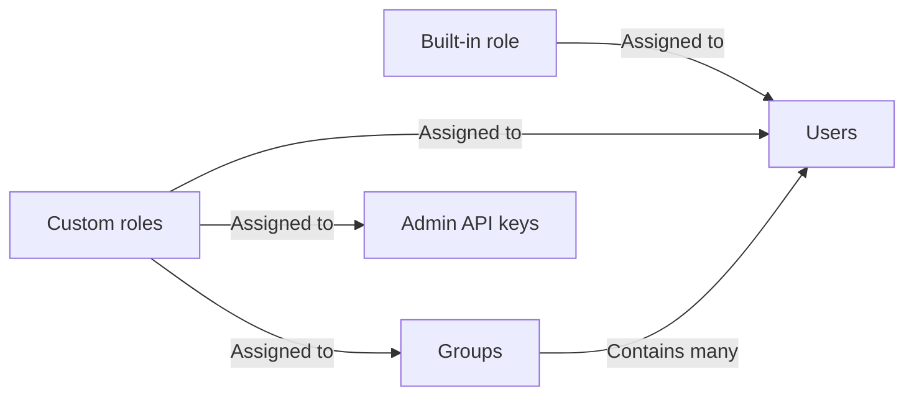

:::info

Role-based access control requires an [Enterprise subscription](https://www.flagsmith.com/pricing).

:::

Role-based access control (RBAC) provides fine-grained access management of Flagsmith resources. Using RBAC, you can
ensure users only have the access they need within your Flagsmith organisation.

For example, RBAC allows you to achieve the following scenarios:

- Only allow certain users to modify your production environments.
- Grant a default set of permissions to all users that join your Flagsmith organisation.
- Lock down an [Admin API](/clients/rest/#private-admin-api-endpoints) key to a specific set of permissions.
- Provide Flagsmith permissions based on your enterprise identity provider's groups when using
  [SAML single sign-on](/system-administration/authentication/SAML/).

To add users to your Flagsmith organisation or to manage user permissions, click on your organisation name in the top
left and open the **Users and Permissions** tab.

## Core concepts

The diagram below shows an overview of how permissions are assigned within your Flagsmith organisation:

### Roles

A role is a set of permissions that, when assigned, allows performing specific actions on your organisation, projects or
project environments.

**Built-in roles** are predefined by Flagsmith and cannot be modified. All users in your organisation have one of the
following built-in roles:

- _Organisation Administrator_ grants full access to everything in your Flagsmith organisation.
- _User_ grants no access and requires you to assign permissions using custom roles and/or groups.

**Custom roles** can be assigned to users, groups or [Admin API](/clients/rest/#private-admin-api-endpoints) keys. Any
number of custom roles can be created and assigned.

Creating, modifying or assigning roles requires organisation administrator permissions.

### Groups

A group is a collection of users. If a custom role is assigned to a group, the role's permissions will be granted to all
group members. Users can belong to any number of groups.

Creating or modifying existing groups requires organisation administrator permissions.

Permissions to add or remove users from groups can be granted in two ways:

- The _manage group membership_ permission allows modifying any group's membership
- A _group admin_ can manage membership only for that group

## Add users to your organisation

You can add users to your organisation by sending them an invitation email from Flagsmith, or by sharing an invitation
link directly with them. Both options require organisation administrator permissions, and are available from **Users and
Permissions > Members**.

Users can also join your organisation directly by logging in to Flagsmith using
[single sign-on](/system-administration/authentication/SAML/).

### Email invites

To send invitation emails to specific users, click on **Invite members**. Then, fill in the email address and built-in
role of each user you want to invite.

When a user accepts their email invitation, they will be prompted to sign up for a Flagsmith account, or they can choose
to log in if they already have an account with the same email address.

Users who have not yet accepted their invitations are listed in the "Pending invites" section at the bottom of this
page. From here you can also resend or revoke any pending invitations.

If you are self-hosting Flagsmith, you must [configure an email provider](/locally-api#email-environment-variables)
before using email invites.

### Invitation links

:::warning

Anyone with an invitation link can join your Flagsmith organisation at any time. Share these links with caution and
regenerate them if they are compromised.

:::

Direct links to join your organisation can be found in the **Team Members** section of this page. One direct link is
available for each built-in role that users will have when joining your organisation.

## Provision permissions

If a user joins your organisation with the built-in _User_ role, they will not have any permissions to view or change
anything in your Flagsmith organisation. You can provide default fine-grained permissions to users with any of these
options:

- Add users by default to a group. When creating or editing a group, select the **Add new users by default** option.
  When a user logs in for the first time to your organisation, they will automatically be added to all groups that have
  this option enabled.
- [Use existing groups from your enterprise identity provider](/system-administration/authentication/SAML/#using-groups-from-your-saml-idp).
  Any time a user logs in using single sign-on, they will be made a member of any groups with matching external IDs.

## Permissions reference

Permissions can be assigned at 3 levels: Organisation, Project, and Environment.

### Organisation

| **Permission**     | **Ability**                                                  |
| ------------------ | ------------------------------------------------------------ |
| Create Project     | Allows the user to create Projects in the given Organisation |
| Manage User Groups | Allows the user to manage group membership.                  |

### Project

| **Permission**     | **Ability**                                                                                |
| ------------------ | ------------------------------------------------------------------------------------------ |
| Administrator      | Full Read/Write over all Environments, Feature Flag, Remote Config, Segment and Tag values |
| View Project       | Can view the Project within their account                                                  |
| Create Environment | Can create new Environments within the Project                                             |
| Create Feature     | Can create a new Feature / Remote Config                                                   |
| Delete Feature     | Can remove an existing Feature / Remote Config entirely from the Project                   |
| Manage Segments    | Can create, delete and edit Segments within the Project                                    |
| View audit log     | Allows the user to view the audit logs for this Project.                                   |

### Environment

| **Permission**           | **Ability**                                                     |
| ------------------------ | --------------------------------------------------------------- |
| Administrator            | Can modify Feature Flag, Remote Config and Segment values       |
| View Environment         | Can see the Environment within their account                    |
| Update Feature State     | Update the state or value for a given feature                   |
| Manage Identities        | View and update Identities                                      |
| Manage Segment Overrides | Permission to manage segment overrides in the given environment |
| Create Change Request    | Creating a new Change Request                                   |
| Approve Change Request   | Approving or denying existing Change Requests                   |
| View Identities          | Viewing Identities                                              |
