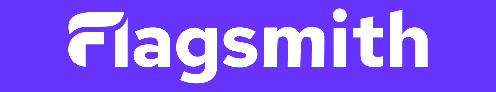
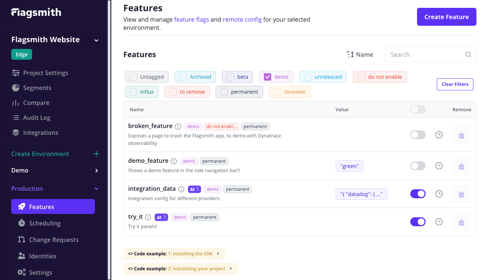

[](https://www.flagsmith.com/)

[](https://github.com/Flagsmith/flagsmith/stargazers)
[](https://hub.docker.com/u/flagsmith)
[](https://hub.docker.com/u/flagsmith/flagsmith)
[](https://discord.gg/hFhxNtXzgm)

[Flagsmith](https://www.flagsmith.com/) is an open source, fully featured, Feature Flag and Remote Config service. Use
our hosted API, deploy to your own private cloud, or run on-premise.

# Flagsmith

Flagsmith makes it easy to create and manage features flags across web, mobile, and server side applications. Just wrap
a section of code with a flag, and then use Flagsmith to toggle that feature on or off for different environments, users
or user segments.

Get up and running in 1 minute with:

```bash
git clone git@github.com:flagsmith/self-hosted.git
docker-compose -f self-hosted/docker-compose.yml up
```



## Features

- **Feature flags**. Release features with confidence through phased rollouts.
- **Remote config**. Easily toggle individual features on and off, and make changes without deploying new code.
- **A/B and Multivariate Testing**. Use segments to run A/B and multivariate tests on new features. With segments, you
  can also introduce beta programs to get early user feedback.
- **Organization Management**. Organizations, projects, and roles for team members help keep your deployment organized.
- **Integrations**. Easily enhance Flagsmith with your favourite tools.

## Trying Flagsmith

### Flagsmith hosted SaaS

You can try our hosted version for free at https://www.flagsmith.com/

### Flagsmith Open Source

The Flagsmith API is built using Python 3, Django 2, and DjangoRestFramework 3. You can try the application out using:

- [Docker](/docker)
- [Kubernetes](https://github.com/Flagsmith/flagsmith-charts)
- [Redhat OpenShift](https://operatorhub.io/operator/flagsmith)

We also have options for deploying to AWS, GCP and Azure. If you need help getting up and running, please
[get in touch!](mailto:support@flagsmith.com)

## Overview

This repository is formed of 2 core components, the REST API (found in `/api`) and the web-based administrator dashboard
(found in `/frontend`) that you can use to manage Flagsmith. Technical documentation for each component can be found at
the [API](https://docs.flagsmith.com/deployment/locally-api) and
[Frontend](https://docs.flagsmith.com/deployment/locally-frontend) pages within our
[Documentation](https://docs.flagsmith.com/)

These two components run as separate applications. The web-based dashboard is a single page app that communicates via
REST calls to the API.

## Docker

You can run the entire Flagsmith with Docker by running the following command:

```bash
docker-compose -f docker/docker-compose.yml up
```

This will use some default settings created in the `docker/docker-compose.yml` file. These should be changed before
running in any sort of production environments.

## Resources

- [Website](https://www.flagsmith.com/)
- [Documentation](https://docs.flagsmith.com/)
- If you have any questions about our projects you can email [support@flagsmith.com](mailto:support@flagsmith.com)
